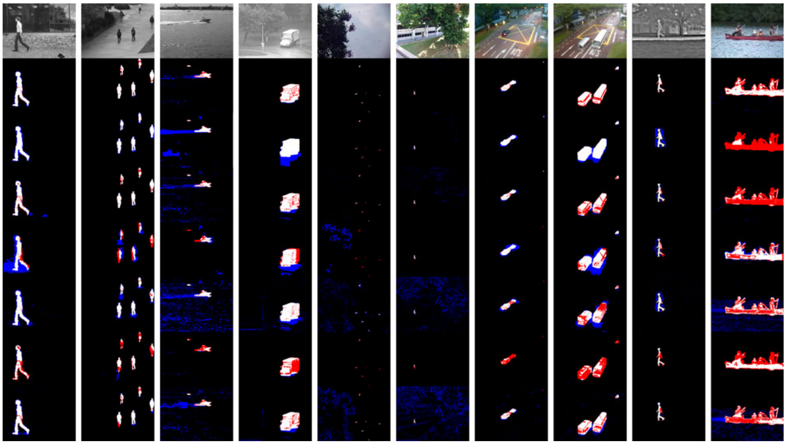
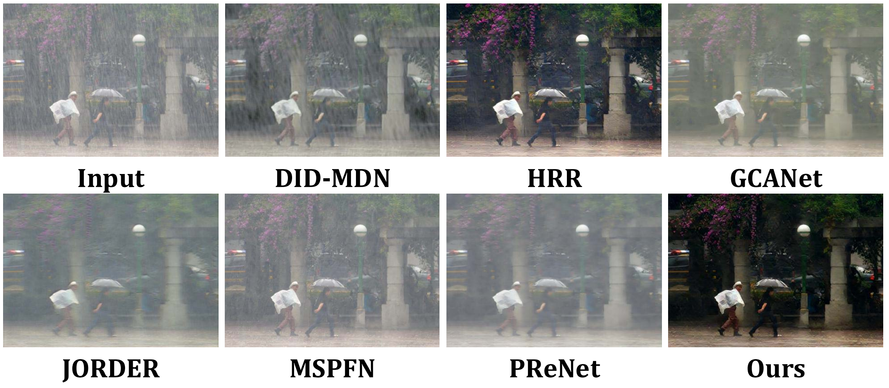

I am currently working as a Full Professor, Doctoral Supervisor at the School of Remote Sensing and Information Engineering, Wuhan University. 

I received the prestigious "the 1000 talents plan for young talents" award and Hubei Province Funds for Distinguished Young Scientists. In addition, I am also a "Chutian Scholar" distinguished Professor in Hubei Province. 

In the past 11 years, I have worked as a postdoctoral fellow, research Fellow and independent PI at the National University of Singapore. 

In terms of scientific research projects, I was responsible for 5 Singapore national projects and 1 international cooperative project. As the sub-team leader, I participated in 5 Singapore national projects and 1 international cooperative project, and obtained 1 intellectual property transfer (70% share). I participated in a number of China Natural Science Foundation and 973 projects during my master’s and doctor’s degrees. 

In terms of academic papers, I have published 68 academic papers, including 25 SCI papers, which have been published in IJCV, IEEE PAMI, ISPRS JPRS, IEEE TGRS, IEEE ITS and other top journals. 

In terms of talent cultivation, I have supervised 6 doctoral students, 2 post-doctoral students, 13 master students, and 55 interns and exchange students. 

In terms of academic posts, I served as the editorial board of two journals. Editor of three international conferences, member of the Procedural committee and chairman of sub-forums; As a reviewer of 28 SCI journals including IEEE TIP, ISPRS JPRS, IEEETSP, CVIU, etc.

# Research

<!-- ################################  CONTENT START  #######################################-->
<table width="100%" align="center" border="0" cellspacing="0" cellpadding="0" style="font-size:1em">
   <tbody>
    <!-- ------------ Paper Start  ----------------- -->
    <tr>
      <!-- <td width="30%">
         
      </td> -->
      <td valign="top" width="70%">
        <!-- <a href="https://ieeexplore.ieee.org/document/8629321">  -->
          <strong>1. Research on Object Detection Algorithm of Weakly Supervised and Few-shot Learning Based on MindSpore</strong> 
        <!-- </a> -->
     
        Chinese Association for Artificial Intelligence, Academic Award Fund Research Project 
     
        In research. <strong>Lead</strong>. 2020.12-2021.11
        

        

      </td>
    </tr>    
    <!-- ------------ Paper End ----------------- -->    
    <!-- ------------ Paper Start  ----------------- -->
    <tr>
      <!-- <td width="30%">
         
      </td> -->
      <td valign="top" width="70%">
        <!-- <a href="https://ieeexplore.ieee.org/document/8629321">  -->
          <papertitle>2. Research on Visual Data Enhancement Technology under Severe Conditions Oriented by Geometric Information Extraction</papertitle> 
        <!-- </a> -->
     
        Multinational companies, Horizontal Project 
     
        In research. <strong>Lead</strong>.  2020.06-2021.12
        

        

      </td>
    </tr>    
    <!-- ------------ Paper End ----------------- -->   
    <!-- ------------ Paper Start  ----------------- -->
    <tr>
      <!-- <td width="30%">
         
      </td> -->
      <td valign="top" width="70%">
        <!-- <a href="https://ieeexplore.ieee.org/document/8629321">  -->
          <papertitle>3. Multi-source Optical Satellite Remote Sensing Image Intelligent Processing and Quantitative Information Extraction</papertitle> 
        <!-- </a> -->
     
        Natural Science Foundation of Hubei Province, Innovation Group Project
     
        in research. Participated. 2020.03-2023.03
        

        

      </td>
    </tr>    
    <!-- ------------ Paper End ----------------- -->       
    
</tbody></table>

# Publications
<table width="100%" align="center" border="0" cellspacing="0" cellpadding="0">
   <tbody>
    <!-- ------------ Paper Start  ----------------- -->
    <tr>
      <td width="30%">
         
      </td>
      <td valign="top" width="70%">
        <a href="https://ieeexplore.ieee.org/document/6781644"> 
          <papertitle>Block‐Sparse RPCA for Salient Motion Detection</papertitle> 
        </a>
     
        <strong>Zhi Gao*</strong>, L‐F Cheong, Y‐X Wang
     
        <em>IEEE Transactions on Pattern Analysis and Machine Intelligence, 36(10): 1975‐1987 (2014)</em>  
        <!-- <a href="https://ieeexplore.ieee.org/document/8629321">Link</a> -->
        

        

      </td>
    </tr>    
    <!-- ------------ Paper End ----------------- -->  
    <!-- ------------ Paper Start  ----------------- -->
    <tr>
      <td width="30%">
         
      </td>
      <td valign="top" width="70%">
        <a href="https://ieeexplore.ieee.org/document/9499966"> 
          <papertitle>A Two-Stage Density-Aware Single Image Deraining Method</papertitle> 
        </a>
     
        M Cao, <strong>Zhi Gao*</strong>, B Ramesh, T Mei; J Cui
     
        <em>IEEE Transactions on Image Processing, 30: 6843-6854.(2021)</em>  
        <!-- <a href="https://ieeexplore.ieee.org/document/8629321">Link</a> -->
        

        

      </td>
    </tr>    
    <!-- ------------ Paper End ----------------- -->    
        
</tbody></table>

# Service to the Academy Profession

1.	Commissioning Editor for Journal of Signal and information Processing
2.	Editorial Board Member of Unmanned Systems
3.	Procedure Committee Member, Editor, Sub-forum Chair for IEEE International Conference on Advanced Robotics and Mechatronics 2018 (Singapore)
4.	Editor of 14th IEEE International Conference on Control and Automation 2018 (USA) and 15th IEEE International Conference on Control and Automation 2019 (UK) 
5.	Reviewer for IEEE Transactions on Image Processing, IEEE Transactions on Geoscience and Remote Sensing, ISPRS Journal of Photogrammetry and Remote Sensing, IEEE Transactions on Intelligent Transportation Systems, IEEE Transactions on Circuits and Systems for Video Technology, IEEE Transactions on Signal Processing, IEEE Geoscience and Remote Sensing Letters, Computer Vision and Image Understanding, and many famous international conferences (CVPR, ECCV,  ACCV,  BMVC).

# Cultivation of Talents

Prof. GAO has supervised 6 doctoral students, 2 post-doctoral students, 13 master students and 55 interns and exchange students. Many of our undergraduate students are pursuing their doctoral degrees in The National University of Singapore, while others have entered other world-renowned universities for further study, including Stanford University, Carnegie Mellon University, University of California at Berkeley, and University of Michigan at Ann Arbor. Many of our PhD and Master degree graduates have worked in world-renowned companies, including Amazon, Microsoft, Google, Facebook, Intel, VISA, etc.

