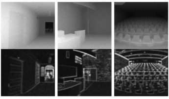

# 简介

高智教授现就职于武汉大学遥感信息工程学院，教授、博士生导师，国家海外高层次人才计划（青年项目）获得者，湖北省楚天学者特聘教授，湖北省杰青。高智教授长期从事人工智能、计算机视觉与智能无人系统相关的核心问题研究，及其在测绘遥感领域的应用研究。高智教授曾经在新加坡国立大学工作11年，先后担任博士后，博士后研究员，研究员及独立PI的职位。高智教授在科研项目、学术论文、人才培养、学术服务等方面取得优异成果。在科研项目方面，作为项目负责人或课题负责人主持了中国、新加坡政府项目10余项及跨国公司合作项目6项，包括新加坡国防部科技研究院项目6项、新加坡国防部未来系统发展署项目4项、新加坡教育部项目1项、中国自然科学基金委项目1项、湖北省自然科学基金杰出青年项目、创新群体项目，公司合作方面包括华为项目2项、重庆长安1项、AeroLion Tech 1项等。在学术论文方面，发表学术论文80余篇，其中SCI论文35篇，发表在IEEE PAMI、IJCV、IEEE TIP、ISPRS JPRS、IEEE TGRS、IEEE ITS、CVPR、ECCV、ICRA、IROS等顶级期刊及会议。在人才培养方面，指导博士后4人、博士生12人、硕士生33人，并指导学生多次在国内外比赛中获奖。在学术服务方面，曾担任2项期刊的编委，3项国际会议的编辑、程序委员会成员和分论坛主席，受邀发表主题演讲10余次。高智教授具有广泛的国际、国内合作，与卡内基梅隆大学、新加坡国立大学、香港中文大学、鹏城国家实验室、同济大学、浙江大学、北京理工大学建立了长期密切的合作关系。

# 代表性科研项目

<!-- ################################  CONTENT START  #######################################-->
<table width="100%" align="center" border="0" cellspacing="0" cellpadding="0" style="font-size:1em">
   <tbody>
    <!-- ------------ Paper Start  ----------------- -->
    <tr>
      <!-- <td width="30%">
         
      </td> -->
      <td valign="top" width="70%">
        <!-- <a href="https://ieeexplore.ieee.org/document/8629321">  -->
          <strong>1. 地表异常遥感探测与即时诊断方法
</strong> 
        <!-- </a> -->
     
        国家自然科学基金, 重点项目 
     
        在研. <strong>主持</strong>. 370万元. 2022.01-2026.12
        

        

      </td>
    </tr>   
    <!-- ------------ Paper Start  ----------------- -->
    <tr>
      <!-- <td width="30%">
         
      </td> -->
      <td valign="top" width="70%">
        <!-- <a href="https://ieeexplore.ieee.org/document/8629321">  -->
          <papertitle>2. 复杂环境中多智能体协同的定位与场景感知研究</papertitle> 
        <!-- </a> -->
     
        湖北省自然科学基金, 杰出青年项目
     
        在研. <strong>主持</strong>. 30万元. 2021.12-2024.12
        

        

      </td>
    </tr>    
    <!-- ------------ Paper End ----------------- -->    
    <!-- ------------ Paper Start  ----------------- -->
    <tr>
      <!-- <td width="30%">
         
      </td> -->
      <td valign="top" width="70%">
        <!-- <a href="https://ieeexplore.ieee.org/document/8629321">  -->
          <papertitle>3. 几何信息提取导向的恶劣条件下视觉数据增强技术研究</papertitle> 
        <!-- </a> -->
     
        华为技术有限公司, 横向项目
     
        在研. <strong>主持</strong>. 80万元. 2020.06-2021.12
        

        

      </td>
    </tr>    
    <!-- ------------ Paper End ----------------- -->   
    <!-- ------------ Paper Start  ----------------- -->
    <tr>
      <!-- <td width="30%">
         
      </td> -->
      <td valign="top" width="70%">
        <!-- <a href="https://ieeexplore.ieee.org/document/8629321">  -->
          <papertitle>4. 多源光学卫星遥感影像智能处理与定量信息提取</papertitle> 
        <!-- </a> -->
     
        湖北省自然科学基金, 创新群体项目
     
        在研. <strong>课题负责人</strong>. 50万元. 2020.03-2023.03
        

        

      </td>
    </tr>    
    <!-- ------------ Paper End ----------------- -->   
    <tr>
      <!-- <td width="30%">
         
      </td> -->
      <td valign="top" width="70%">
        <!-- <a href="https://ieeexplore.ieee.org/document/8629321">  -->
          <strong>5. 基于MindSpore弱监督、小样本学习条件的目标检测算法研究</strong> 
        <!-- </a> -->
     
        中国人工智能学会, 学术奖励基金研究课题项目 
     
        在研. <strong>主持</strong>. 9万元. 2020.12-2021.11
        

        

      </td>
    </tr>    
    <!-- ------------ Paper End ----------------- -->     
    
</tbody></table>

# 代表性学术论文
<table width="100%" align="center" border="0" cellspacing="0" cellpadding="0">
   <tbody>
    <!-- ------------ Paper Start  ----------------- -->
    <tr>
      <td width="30%">
         
      </td>
      <td valign="top" width="70%">
        <a href="https://ieeexplore.ieee.org/document/6781644"> 
          <papertitle>Block‐Sparse RPCA for Salient Motion Detection</papertitle> 
        </a>
     
        <strong>Zhi Gao*</strong>, L‐F Cheong, Y‐X Wang
     
        <em>IEEE Transactions on Pattern Analysis and Machine Intelligence, 36(10): 1975‐1987 (2014) (IF:16.389)</em>  
        <!-- <a href="https://ieeexplore.ieee.org/document/8629321">Link</a> -->
        

        

      </td>
    </tr>    
    <!-- ------------ Paper End ----------------- -->  
    <!-- ------------ Paper Start  ----------------- -->
    <tr>
      <td width="30%">
         
      </td>
      <td valign="top" width="70%">
        <a href="https://ieeexplore.ieee.org/document/9499966"> 
          <papertitle>A Two-Stage Density-Aware Single Image Deraining Method</papertitle> 
        </a>
     
        M Cao, <strong>Zhi Gao*</strong>, B Ramesh, T Mei; J Cui
     
        <em>IEEE Transactions on Image Processing, 30: 6843-6854 (2021) (IF: 10.856)</em>  
        <!-- <a href="https://ieeexplore.ieee.org/document/8629321">Link</a> -->
        

        

      </td>
    </tr>    
    <!-- ------------ Paper End ----------------- -->    
        
</tbody></table>

# 学术服务

1.	担任期刊Unmanned Systems的编委
2.	担任期刊The Photogrammetric Record的编委
3.	担任国际会议IEEE International Conference on Advanced Robotics and Mechatronics 2018 (Singapore)程序委员会委员，编辑，分论坛主席
4.	担任14th IEEE International Conference on Control and Automation 2018 (USA)和15th IEEE International Conference on Control and Automation 2019 (UK)编辑
5.	担任包括IEEE Transactions on Image Processing, IEEE Transactions on Geoscience and Remote Sensing, ISPRS Journal of Photogrammetry and Remote Sensing, IEEE Transactions on Intelligent Transportation Systems, IEEE Transactions on Circuits and Systems for Video Technology, IEEE Transactions on Signal Processing, IEEE Geoscience and Remote Sensing Letters, Computer Vision and Image Understanding等在内的35种SCI期刊的审稿人,以及CVPR, ECCV, ACCV, BMVC等多项著名国际会议的审稿人

# 人才培养

已指导博士后4人、博士生12人、硕士生33人。硕、博士毕业生中，多人进入世界著名公司任职，包括亚马逊、微软、谷歌、Facebook、Intel、VISA、商汤等。另有多人进入世界名校学习深造，包括斯坦福大学、卡内基梅隆大学、加州大学伯克利分校，密歇根大学安娜堡分校、新加坡国立大学、香港中文大学等。指导学生多次在国内外比赛中获奖，包括IMAV2015亚军，2020全国“互联网+”大赛银奖，2021全国“软件杯”一等奖。

