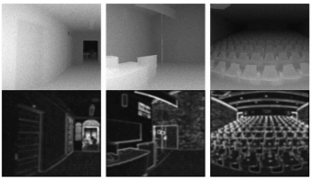

# Area of Interest
## Vision for intelligent systems
Visual-inertial-odometry (VIO), SLAM, Visual-laser localization, Underwater localization, Visual data enhancement

## Intelligent systems based vision
Scene understanding, Object detection and localization, Visual-laser fusion, Anomaly detection, 3D reconstruction 

# Funded Projects
<!-- ################################  CONTENT START  #######################################-->
<table width="100%" align="center" border="0" cellspacing="0" cellpadding="0" style="font-size:1em">
   <tbody>
    <!-- ------------ Paper Start  ----------------- -->
    <tr>
      <!-- <td width="30%">
         
      </td> -->
      <td valign="top" width="70%">
        <!-- <a href="https://ieeexplore.ieee.org/document/8629321">  -->
          <strong>1. Remote Sensing on-orbit Real-time Diagnosis for the Earth’s Surface Anomalies</strong> 
        <!-- </a> -->
     
        National Natural Science Foundation of China 
     
        In research. <strong>Lead</strong>. 3.7 millon RMB. 2022.01-2026.12
        

        

      </td>
    </tr>    
    <!-- ------------ Paper End ----------------- --> 
   <!-- ------------ Paper Start  ----------------- -->
    <tr>
      <!-- <td width="30%">
         
      </td> -->
      <td valign="top" width="70%">
        <!-- <a href="https://ieeexplore.ieee.org/document/8629321">  -->
          <strong>2. Localization and Scene Perception of Multi-agent Cooperation in Complex Environment</strong> 
        <!-- </a> -->
     
        Natural Science Foundation of Hubei Province
     
        In research. <strong>Lead</strong>. 300,000 RMB. 2021.12-2024.12
        

        

      </td>
    </tr>    
    <!-- ------------ Paper End ----------------- -->    
    <!-- ------------ Paper Start  ----------------- -->
    <tr>
      <!-- <td width="30%">
         
      </td> -->
      <td valign="top" width="70%">
        <!-- <a href="https://ieeexplore.ieee.org/document/8629321">  -->
          <papertitle>3. Research on Visual Data Enhancement Technology under Severe Conditions Oriented by Geometric Information Extraction</papertitle> 
        <!-- </a> -->
     
        Multinational companies, Horizontal Project 
     
        In research. <strong>Lead</strong>. 600,000 RMB. 2020.06-2021.12
        

        

      </td>
    </tr>    
    <!-- ------------ Paper End ----------------- -->   
    <!-- ------------ Paper Start  ----------------- -->
    <tr>
      <!-- <td width="30%">
         
      </td> -->
      <td valign="top" width="70%">
        <!-- <a href="https://ieeexplore.ieee.org/document/8629321">  -->
          <papertitle>4. Multi-source Optical Satellite Remote Sensing Image Intelligent Processing and Quantitative Information Extraction</papertitle> 
        <!-- </a> -->
     
        Natural Science Foundation of Hubei Province, Innovation Group Project
     
        in research. Participated. 500,000 RMB. 2020.03-2023.03
        

        

      </td>
    </tr>    
    <!-- ------------ Paper End ----------------- -->  
    <!-- ------------ Paper Start  ----------------- -->
    <tr>
      <!-- <td width="30%">
         
      </td> -->
      <td valign="top" width="70%">
        <!-- <a href="https://ieeexplore.ieee.org/document/8629321">  -->
          <strong>5. Research on Object Detection Algorithm of Weakly Supervised and Few-shot Learning Based on MindSpore</strong> 
        <!-- </a> -->
     
        Chinese Association for Artificial Intelligence, Academic Award Fund Research Project 
     
        In research. <strong>Lead</strong>. 90,000 RMB. 2020.12-2021.11
        

        

      </td>
    </tr>    
    <!-- ------------ Paper End ----------------- -->   
    <!-- ------------ Paper Start  ----------------- -->
    <tr>
      <!-- <td width="30%">
         
      </td> -->
      <td valign="top" width="70%">
        <!-- <a href="https://ieeexplore.ieee.org/document/8629321">  -->
          <papertitle>6. Research on Visual Localization under Severe Weather Conditions</papertitle> 
        <!-- </a> -->
     
        Cooperation project of International Corporation
     
        Completed. 1/5. 1 million RMB. 2019.11-2021.01
        

        

      </td>
    </tr>    
    <!-- ------------ Paper End ----------------- -->   
    <!-- ------------ Paper Start  ----------------- -->
    <tr>
      <!-- <td width="30%">
         
      </td> -->
      <td valign="top" width="70%">
        <!-- <a href="https://ieeexplore.ieee.org/document/8629321">  -->
          <papertitle>7. Environmental perception and visual localization based on deep learning</papertitle> 
        <!-- </a> -->
     
        Singapore National Goveronment Research Institute, National Goveronment Research Project
     
        Completed. Participated. 500,000 RMB. 2019.01-2020.06
        

        

      </td>
    </tr>    
    <!-- ------------ Paper End ----------------- -->   
    <!-- ------------ Paper Start  ----------------- -->
    <tr>
      <!-- <td width="30%">
         
      </td> -->
      <td valign="top" width="70%">
        <!-- <a href="https://ieeexplore.ieee.org/document/8629321">  -->
          <papertitle>8.	Deep Learning based Visual Localization for Intelligent Systems</papertitle> 
        <!-- </a> -->
     
        Future System Development Agency, National Government Research Project, Singapore
     
        Completed. 1/4. 60,000 Singapore dollars. 2019.01-2019.12
        

        

      </td>
    </tr>    
    <!-- ------------ Paper End ----------------- -->
    <!-- ------------ Paper Start  ----------------- -->
    <tr>
      <!-- <td width="30%">
         
      </td> -->
      <td valign="top" width="70%">
        <!-- <a href="https://ieeexplore.ieee.org/document/8629321">  -->
          <papertitle>9.	Multi-agent-based Localization and Scene Reconstruction</papertitle> 
        <!-- </a> -->
     
      Ministry of National Government, Singapore
     
        Completed. 1/6. 150,000 Singapore dollars. 2018.04-2019.10
        

        

      </td>
    </tr>    
    <!-- ------------ Paper End ----------------- -->
    <!-- ------------ Paper Start  ----------------- -->
    <tr>
      <!-- <td width="30%">
         
      </td> -->
      <td valign="top" width="70%">
        <!-- <a href="https://ieeexplore.ieee.org/document/8629321">  -->
          <papertitle>10.	Event Detection Based on Event Camera</papertitle> 
        <!-- </a> -->
     
      Future System Development Agency, National Government Research Project, Singapore
     
        Completed. Participated. 300,000 RMB. 2018.02-2019.07
        

        

      </td>
    </tr>    
    <!-- ------------ Paper End ----------------- -->
    <!-- ------------ Paper Start  ----------------- -->
    <tr>
      <!-- <td width="30%">
         
      </td> -->
      <td valign="top" width="70%">
        <!-- <a href="https://ieeexplore.ieee.org/document/8629321">  -->
          <papertitle>11.	Traffic Behavior Monitoring Based on Intelligent UAV</papertitle> 
        <!-- </a> -->
     
      Singapore National Government Research Institute, National Government Research Project
     
        Completed. <strong>Chaired</strong>. 500,000 RMB. 2018.02-2019.08
        

        

      </td>
    </tr>    
    <!-- ------------ Paper End ----------------- -->
    <!-- ------------ Paper Start  ----------------- -->
    <tr>
      <!-- <td width="30%">
         
      </td> -->
      <td valign="top" width="70%">
        <!-- <a href="https://ieeexplore.ieee.org/document/8629321">  -->
          <papertitle>12.	Research on Multi-Sensor Fusion Intelligent UAV Platform</papertitle> 
        <!-- </a> -->
     
      Future System Development Agency, National Government Research Project, Singapore
     
        Completed. Paticipated. 6 million RMB. 2018.03-2020.04
        

        

      </td>
    </tr>    
    <!-- ------------ Paper End ----------------- -->
    <!-- ------------ Paper Start  ----------------- -->
    <tr>
      <!-- <td width="30%">
         
      </td> -->
      <td valign="top" width="70%">
        <!-- <a href="https://ieeexplore.ieee.org/document/8629321">  -->
          <papertitle>13.	Scene Reconstruction from Sparse to Dense</papertitle> 
        <!-- </a> -->
     
      Future System Development Agency, National Government Research Project, Singapore
     
        Completed. <strong>Chaired</strong>. 300,000 RMB. 2017.01-2018.01
        

        

      </td>
    </tr>    
    <!-- ------------ Paper End ----------------- -->
    <!-- ------------ Paper Start  ----------------- -->
    <tr>
      <!-- <td width="30%">
         
      </td> -->
      <td valign="top" width="70%">
        <!-- <a href="https://ieeexplore.ieee.org/document/8629321">  -->
          <papertitle>14.	Event-camera-based Anomaly Detection</papertitle> 
        <!-- </a> -->
     
      National Government Institute of  Science, Singapore
     
        Completed. 2/4. 50,000 Singapore dollars. 2017.01-2018.01
        

        

      </td>
    </tr>    
    <!-- ------------ Paper End ----------------- -->
    <!-- ------------ Paper Start  ----------------- -->
    <tr>
      <!-- <td width="30%">
         
      </td> -->
      <td valign="top" width="70%">
        <!-- <a href="https://ieeexplore.ieee.org/document/8629321">  -->
          <papertitle>15.	Robot Eye</papertitle> 
        <!-- </a> -->
     
      Future System Development Agency, National Government Research Project, Singapore
     
        Completed. 2/7. 600,000 Singapore dollars. 2015.01-2019.01
        

        

      </td>
    </tr>    
    <!-- ------------ Paper End ----------------- -->
    <!-- ------------ Paper Start  ----------------- -->
    <tr>
      <!-- <td width="30%">
         
      </td> -->
      <td valign="top" width="70%">
        <!-- <a href="https://ieeexplore.ieee.org/document/8629321">  -->
          <papertitle>16. UAV Navigation Based on Google Maps</papertitle> 
        <!-- </a> -->
     
      Singapore National Government Research Institute, National Government Research Project, Singapore
     
        Completed. <strong>Chaired</strong>. 250,000 RMB. 2014.06-2015.02
        

        

      </td>
    </tr>    
    <!-- ------------ Paper End ----------------- -->
    <!-- ------------ Paper Start  ----------------- -->
    <tr>
      <!-- <td width="30%">
         
      </td> -->
      <td valign="top" width="70%">
        <!-- <a href="https://ieeexplore.ieee.org/document/8629321">  -->
          <papertitle>17. Object Detection in Complex Background Based on Motion Platform</papertitle> 
        <!-- </a> -->
     
      Singapore National Government Research Institute DSO, National Government Research Project
     
        Completed. <strong>Chaired</strong>. 250,000 RMB. 2013.02-2014.03
        

        

      </td>
    </tr>    
    <!-- ------------ Paper End ----------------- -->
    <!-- ------------ Paper Start  ----------------- -->
    <tr>
      <!-- <td width="30%">
         
      </td> -->
      <td valign="top" width="70%">
        <!-- <a href="https://ieeexplore.ieee.org/document/8629321">  -->
          <papertitle>18.	Object detection in Dynamic Environment from a Motion Platform</papertitle> 
        <!-- </a> -->
     
      National Institute of Government Science, Singapore
     
        Completed. 1/5. 100,000 Singapore dollars. 2013.01-2014.01
        

        

      </td>
    </tr>    
    <!-- ------------ Paper End ----------------- -->
    <!-- ------------ Paper Start  ----------------- -->
    <tr>
      <!-- <td width="30%">
         
      </td> -->
      <td valign="top" width="70%">
        <!-- <a href="https://ieeexplore.ieee.org/document/8629321">  -->
          <papertitle>19.	Theory and method of high-precision digital reconstruction of complex geometric objects</papertitle> 
        <!-- </a> -->
     
      973 project
     
        Completed. 3/15. 2.3 million RMB. 2012.09-2016.09
        

        

      </td>
    </tr>    
    <!-- ------------ Paper End ----------------- -->
    
</tbody></table>

