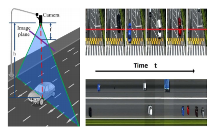
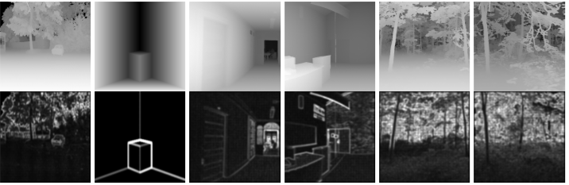
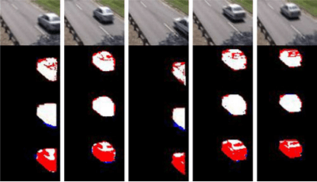

# Area of Interest
## Vision for intelligent systems
Visual-inertial-odometry (VIO), SLAM, Visual-laser localization, Underwater localization, Visual data enhancement

## Intelligent systems based vision
Scene understanding, Object detection and localization, Visual-laser fusion, Anomaly detection, 3D reconstruction 

# Funded Projects
Content

<!-- ################################  CONTENT START  #######################################-->
<table width="100%" align="center" border="0" cellspacing="0" cellpadding="0">
   <tbody>
    <!-- ------------ Paper Start  ----------------- -->
    <tr>
      <td width="30%">
         
      </td>
      <td valign="top" width="70%">
        <a href="https://ieeexplore.ieee.org/document/8629321"> 
          <papertitle>Transform Learning Based Sparse Coding for LiDAR Data Denoising</papertitle> 
        </a>
     
        <strong>Zhi Gao</strong>, 
        Hong Ji
     
        <em> IEEE Signal Processing Letters, 26(3):	480‐484	(2019) </em>  
        <a href="https://ieeexplore.ieee.org/document/8629321">Link</a>
        

        

      </td>
    </tr>    
    <!-- ------------ Paper End ----------------- -->    
    <!-- ------------ Paper Start  ----------------- -->
    <tr>
      <td width="30%">
         
      </td>
      <td valign="top" width="70%">
        <a href="https://ieeexplore.ieee.org/document/8168342"> 
          <papertitle>Synergizing	Appearance and Motion with Low Rank Representation	 for	 Vehicle	 Counting	 and	 Traffic	 Flow	 Analysis</papertitle> 
        </a>
     
        <strong>Zhi Gao</strong>, 
        Ruifang Zhai,Pengfei Wang,Xu Yan,Hailong Qin,Yazhe Tang,Xu Yan,Bharath Ramesh
     
        <em> IEEE Transactions on Intelligent Transportation Systems,	 19(8):	
2675‐2685	(2018) </em>  
        <a href="https://ieeexplore.ieee.org/document/8168342">Link</a>
        

        

      </td>
    </tr>    
    <!-- ------------ Paper End ----------------- --> 
    <!-- ------------ Paper Start  ----------------- -->
    <tr>
      <td width="30%">
         
      </td>
      <td valign="top" width="70%">
        <a href="https://ieeexplore.ieee.org/document/7302018"> 
          <papertitle>Adaptive and Robust Sparse Coding for Laser Range Data Denoising and Inpainting</papertitle> 
        </a>
     
        <strong>Zhi Gao</strong>, 
        Qingquan Li, Ruifang Zhai, Mo Shan, Feng Lin
     
        <em> IEEE Transactions on Circuits and System for
Video Technology,	26(12):	2165‐2175	(2016) </em>  
        <a href="https://ieeexplore.ieee.org/document/7302018">Link</a>
        

        

      </td>
    </tr>    
    <!-- ------------ Paper End ----------------- -->         
    <!-- ------------ Paper Start  ----------------- -->
    <tr>
      <td width="30%">
         
      </td>
      <td valign="top" width="70%">
        <a href="https://ieeexplore.ieee.org/document/6781644"> 
          <papertitle>Block-Sparse RPCA for Salient Motion Detection</papertitle> 
        </a>
     
        <strong>Zhi Gao</strong>, 
        Loong-Fah Cheong,Yu-Xiang Wang
     
        <em>IEEE
Transactions on Pattern Analysis and Machine Intelligence, 36(10):	1975‐1987	(2014)	</em>  
        <a href="https://ieeexplore.ieee.org/document/6781644">Link</a>
        

        

      </td>
    </tr>
    <!-- ------------ Paper End  ----------------- -->
</tbody></table>
